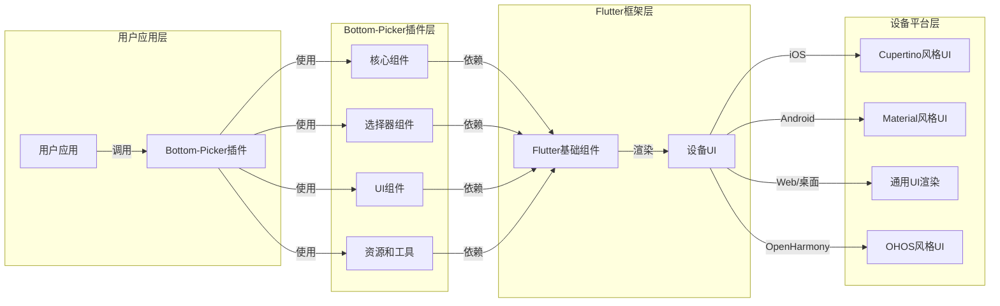
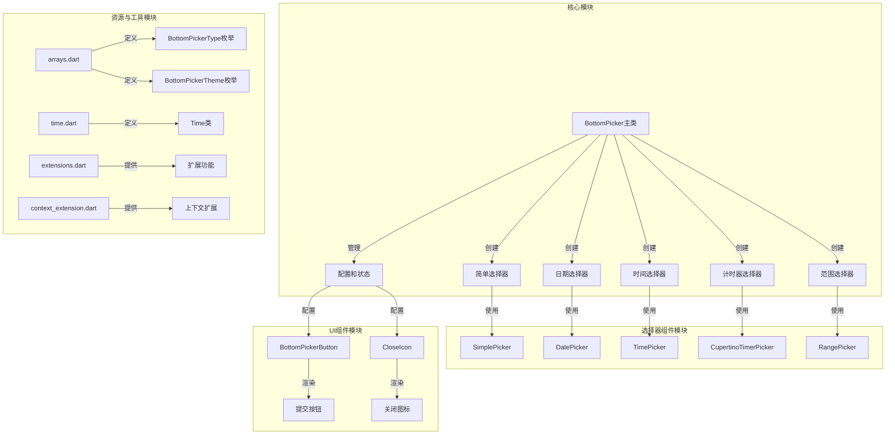
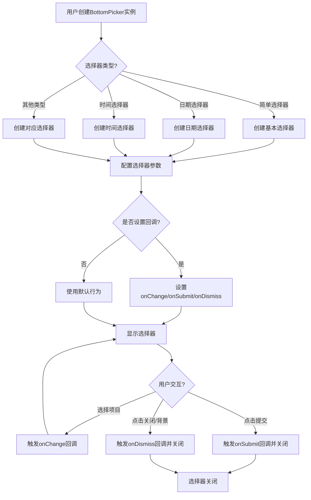

# Bottom-Picker 插件系统架构说明文档

## 1. 项目概述

Bottom-Picker 是一个功能丰富的 Flutter 底部选择器插件，为移动应用提供多种类型的选择器组件。该插件支持简单列表选择、日期选择、时间选择、日期范围选择等多种功能，并提供了高度的自定义选项，使开发者能够根据应用需求灵活配置选择器的外观和行为。

### 主要功能特点

- **多种选择器类型**：简单列表选择器、日期选择器、年份选择器、月年选择器、日期范围选择器、时间选择器、计时器选择器、日期时间选择器
- **高度自定义**：支持自定义头部、按钮样式、背景颜色、文本样式、布局方向等
- **跨平台支持**：完全支持 Web 和桌面平台，通过轮盘视图实现统一体验
- **丰富的交互选项**：24小时/12小时时间格式、可过滤的不可选择日期、自动关闭控制等
- **主题支持**：内置多种主题样式供选择

## 2. 目录结构

Bottom-Picker 插件采用清晰的模块化结构设计，将不同功能的代码组织到专门的目录中。核心代码位于 `lib` 目录，包含主要的选择器实现、UI组件和资源定义。`example` 目录提供了各平台的示例应用，展示插件的使用方法和效果。测试代码位于 `test` 目录，确保插件的基本功能正常运行。

```
├── lib/                        # 主源码目录
│   ├── bottom_picker.dart      # 主入口文件，定义BottomPicker类
│   ├── cupertino/              # Cupertino风格组件
│   │   └── cupertino_date_picker.dart # iOS风格日期选择器实现
│   ├── resources/              # 资源和工具类
│   │   ├── arrays.dart         # 枚举定义（BottomPickerType、BottomPickerTheme等）
│   │   ├── context_extension.dart # 上下文扩展
│   │   ├── extensions.dart     # 扩展功能
│   │   ├── time.dart           # 时间相关类
│   │   └── values.dart         # 常量定义
│   └── widgets/                # UI组件集合
│       ├── bottom_picker_button.dart # 选择器按钮
│       ├── close_icon.dart     # 关闭图标
│       ├── date_picker.dart    # 日期选择器组件
│       ├── range_picker.dart   # 范围选择器组件
│       ├── simple_picker.dart  # 简单列表选择器
│       ├── time_picker.dart    # 时间选择器组件
│       └── year_picker.dart    # 年份选择器组件
├── example/                    # 示例应用
│   ├── lib/                    # 示例代码
│   ├── android/                # Android平台示例
│   ├── ios/                    # iOS平台示例
│   ├── web/                    # Web平台示例
│   ├── windows/                # Windows平台示例
│   ├── macos/                  # macOS平台示例
│   ├── linux/                  # Linux平台示例
│   └── ohos/                   # OpenHarmony平台示例
├── test/                       # 测试代码
│   ├── basic_functionality_test.dart # 基本功能测试
│   └── simple_bottom_picker_test.dart # 简单选择器测试
├── plugin_architecture.mmd     # 插件架构图（Mermaid格式）
└── README.md                   # 项目说明文档
```

### 核心文件说明

| 文件/目录                    | 主要职责                                      | 文件位置                                      |
|----------------------------|---------------------------------------------|---------------------------------------------|
| bottom_picker.dart         | 主入口文件，定义BottomPicker类和各种构造函数         | <mcfile name="bottom_picker.dart" path="lib/bottom_picker.dart"></mcfile> |
| cupertino_date_picker.dart | 实现iOS风格的日期选择器组件                        | <mcfile name="cupertino_date_picker.dart" path="lib/cupertino/cupertino_date_picker.dart"></mcfile> |
| arrays.dart                | 定义插件所需的枚举类型，如选择器类型和主题            | <mcfile name="arrays.dart" path="lib/resources/arrays.dart"></mcfile> |
| simple_picker.dart         | 实现简单列表选择器功能                            | <mcfile name="simple_picker.dart" path="lib/widgets/simple_picker.dart"></mcfile> |
| date_picker.dart           | 实现日期选择器功能                              | <mcfile name="date_picker.dart" path="lib/widgets/date_picker.dart"></mcfile> |
| time_picker.dart           | 实现时间选择器功能                              | <mcfile name="time_picker.dart" path="lib/widgets/time_picker.dart"></mcfile> |
| bottom_picker_button.dart  | 实现选择器的提交按钮                            | <mcfile name="bottom_picker_button.dart" path="lib/widgets/bottom_picker_button.dart"></mcfile> |

## 3. 系统架构

Bottom-Picker 插件采用模块化的架构设计，主要分为以下几个层次：

### 3.1 软件系统上下文定义

Bottom-Picker 插件与用户应用、Flutter框架和设备平台之间的关系如下图所示：



插件通过Flutter的跨平台能力，在不同平台上提供一致的用户体验。对于iOS、Android和OpenHarmony平台，使用Cupertino风格的选择器组件；对于Web和桌面平台，则使用轮盘视图实现类似的功能。

### 3.2 模块划分

Bottom-Picker 插件的模块划分如下：



## 4. 核心模块及功能

### 4.1 BottomPicker 主类

BottomPicker 是整个插件的核心类，负责创建和配置各种类型的选择器。它提供了多个构造函数，用于创建不同类型的选择器：

- **默认构造函数**：创建简单的列表选择器
- **date**：创建日期选择器
- **year**：创建年份选择器
- **monthYear**：创建月份和年份选择器
- **dateTime**：创建日期时间选择器
- **time**：创建时间选择器
- **timer**：创建计时器选择器
- **range**：创建日期范围选择器
- **rangeTime**：创建时间范围选择器

每个构造函数都接受一系列参数，用于配置选择器的外观和行为。这些参数包括：

- `items`：用于简单选择器的项目列表
- `onChange`/`onSubmit`/`onDismiss`：用户交互回调函数
- `headerBuilder`：自定义头部构建器
- `bottomPickerTheme`：选择器主题
- 日期/时间相关配置（如`initialDateTime`、`maxDateTime`、`minDateTime`等）

### 4.2 选择器组件

插件包含多种选择器组件，每种组件负责特定类型的选择功能：

- **SimplePicker**：实现简单的列表选择功能，支持平台适配
- **DatePicker**：实现日期选择功能，封装了CupertinoDatePickerWidget
- **TimePicker**：实现时间选择功能，使用CupertinoTimerPicker
- **RangePicker**：实现日期范围选择功能

这些组件通过Flutter的平台检测机制，在不同平台上提供最佳的用户体验。例如，SimplePicker会根据平台类型选择使用CupertinoPicker（iOS、Android、OpenHarmony）或ListWheelScrollView（Web、桌面）。

### 4.3 UI组件

插件提供了一些UI组件，用于构建选择器的界面：

- **BottomPickerButton**：选择器的提交按钮，支持主题、渐变背景和自定义样式
- **CloseIcon**：选择器的关闭图标

### 4.4 资源与工具

插件包含一些资源和工具类，用于支持选择器的功能：

- **BottomPickerType**：枚举类型，定义了插件支持的选择器类型
- **BottomPickerTheme**：枚举类型，定义了插件支持的主题样式
- **Time**：时间相关的工具类
- **扩展功能**：提供各种扩展方法，增强插件的功能

## 5. 处理流程

Bottom-Picker 插件的处理流程如下图所示：



处理流程的主要步骤如下：

1. **创建实例**：用户通过调用BottomPicker的构造函数创建选择器实例
2. **选择类型**：根据使用的构造函数，确定选择器的类型
3. **配置参数**：根据传入的参数，配置选择器的外观和行为
4. **设置回调**：设置用户交互的回调函数
5. **显示选择器**：调用show方法显示选择器
6. **用户交互**：用户与选择器进行交互（选择项目、点击提交、点击关闭等）
7. **触发回调**：根据用户的交互，触发相应的回调函数
8. **关闭选择器**：交互完成后，选择器关闭

## 6. 平台支持

Bottom-Picker 插件支持多种平台，包括移动平台（iOS、Android、OpenHarmony）和桌面/Web平台（Windows、macOS、Linux、Web）。

### 6.1 平台检测与适配

插件通过Flutter的Platform API检测当前运行的平台，并根据平台类型提供最佳的用户体验。例如，在simple_picker.dart中，使用了以下逻辑进行平台适配：

```dart
if (!kIsWeb && (Platform.isIOS || Platform.isAndroid || Platform.isOhos)) {
  // 使用CupertinoPicker
} else {
  // 使用ListWheelScrollView（适用于Web和桌面平台）
}
```

### 6.2 OpenHarmony平台支持

Bottom-Picker 插件通过Flutter的跨平台能力支持OpenHarmony平台。在代码中，通过`Platform.isOhos`判断当前是否为OpenHarmony平台，并与iOS和Android平台一样，使用CupertinoPicker组件进行渲染。

插件的example目录中包含了专门的ohos子目录，用于展示在OpenHarmony平台上的使用方法和效果。

## 7. 扩展性与定制化

Bottom-Picker 插件提供了丰富的扩展性和定制化选项，使开发者能够根据应用需求灵活配置选择器的外观和行为。

### 7.1 主题定制

插件提供了多种内置主题，开发者可以通过`bottomPickerTheme`参数选择：

- blue
- orange
- temptingAzure
- heavyRain
- plumPlate
- morningSalad

此外，开发者还可以通过`buttonSingleColor`和`gradientColors`参数自定义按钮的颜色。

### 7.2 头部定制

开发者可以通过`headerBuilder`参数自定义选择器的头部，实现个性化的界面设计。

### 7.3 布局方向

插件支持LTR（从左到右）和RTL（从右到左）两种布局方向，开发者可以通过`layoutOrientation`参数设置。

### 7.4 回调函数

插件提供了多种回调函数，使开发者能够响应用户的交互：

- `onChange`：当用户选择不同的项目时触发
- `onSubmit`：当用户点击提交按钮时触发
- `onDismiss`：当选择器关闭时触发

## 8. 输入输出示例

#### 输入输出示例

以下是使用Bottom-Picker插件创建简单列表选择器的示例：

输入：
```dart
BottomPicker(
  items: [
    Text('中国'),
    Text('美国'),
    Text('日本'),
    Text('英国'),
    Text('法国'),
  ],
  headerBuilder: (context) {
    return Row(
      children: [
        Expanded(
          child: Text(
            '选择国家',
            style: TextStyle(
              fontWeight: FontWeight.bold,
              fontSize: 15,
            ),
          ),
        ),
        InkWell(
          onTap: () {
            Navigator.pop(context);
          },
          child: Icon(Icons.close),
        ),
      ],
    );
  },
  onSubmit: (index) {
    print('选择的国家索引：$index');
  },
).show(context);
```

输出：
- 显示一个底部弹出的选择器，包含国家列表
- 当用户选择不同的国家时，选择器会更新当前选中项
- 当用户点击提交按钮时，控制台输出选择的国家索引

## 9. 总结

Bottom-Picker 是一个功能丰富、高度可定制的Flutter底部选择器插件，为开发者提供了多种选择器类型和丰富的定制选项。它采用模块化的架构设计，通过Flutter的跨平台能力，在iOS、Android、OpenHarmony、Web和桌面平台上提供一致的用户体验。

插件的核心优势包括：

- 多种选择器类型，满足不同的应用需求
- 高度的自定义选项，使开发者能够创建个性化的选择器界面
- 完整的平台支持，包括移动、Web和桌面平台
- 丰富的回调函数，方便响应用户的交互
- 清晰的模块化架构，易于维护和扩展

通过合理使用Bottom-Picker插件，开发者可以为应用添加美观、功能强大的底部选择器，提升用户体验。